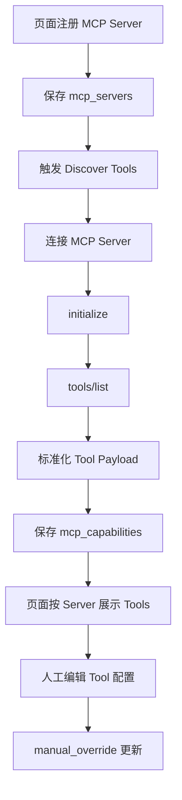

# MCP Framework 标准注册中心设计

## 背景

当前 MCP 管理模块已经具备 `McpServer` 和 `McpCapability` 的基础注册能力，但字段偏平台内部抽象，尚未完整贴合 mcp-framework 的 MCP Server / Tool 运行模型。用户期望：注册 MCP Server 后能够识别该 Server 暴露了哪些 tools，并在页面展示每个 tool 的访问方式、查询条件和返回条件，同时支持自动发现和手工修正。

## 设计目标

1. MCP Server 存储标准化：保存连接、传输、鉴权、协议版本、健康状态、发现状态等字段。
2. MCP Tools 存储标准化：保存 tool name、description、inputSchema、outputSchema、调用配置、来源发现方式、启用状态、风险等级等字段。
3. 支持自动发现：注册 Server 后通过 MCP `tools/list` 获取 tools 并落库。
4. 支持手工维护：页面允许新增、编辑、禁用 tool，并覆盖自动发现结果。
5. 页面按 MCP Server → MCP Tools → Tool Schema / 调用配置 展示。

## MCP Server 字段设计

MCP Server 表示一个符合 MCP 协议的服务端点，推荐字段如下：

| 字段 | 含义 | 示例 |
|------|------|------|
| `server_id` | 平台内唯一 ID | `medical-insurance-policy-knowledge-mcp` |
| `name` | 展示名称 | `医保政策知识 MCP` |
| `description` | 服务说明 | `提供医保政策和错误码查询工具` |
| `endpoint` | 连接端点 | `http://127.0.0.1:9101/mcp` |
| `transport` | MCP 传输方式 | `stdio` / `sse` / `streamable_http` |
| `protocol_version` | MCP 协议版本 | `2025-03-26` |
| `status` | 服务状态 | `enabled` / `disabled` / `degraded` / `unhealthy` |
| `auth_type` | 鉴权方式 | `none` / `bearer` / `api_key` / `custom_headers` |
| `auth_headers` | 鉴权 Header，敏感展示需脱敏 | `{Authorization: Bearer ***}` |
| `connection_config` | 连接配置 | timeout、retry、sse path、stdio command 等 |
| `capabilities_summary` | MCP capabilities 概览 | tools/resources/prompts 是否支持 |
| `discovery_status` | tools/list 发现状态 | `not_discovered` / `success` / `failed` |
| `last_discovered_at` | 最近发现时间 | ISO 时间 |
| `last_error` | 最近错误 | 连接失败、协议错误等 |
| `metadata` | 院内扩展元数据 | owner、domain、vendor |

## MCP Tool 字段设计

MCP Tool 来自 MCP `tools/list` 响应或页面手工维护，推荐字段如下：

| 字段 | 含义 | 示例 |
|------|------|------|
| `tool_id` / `capability_id` | 平台内唯一 ID | `cap-query-policy-by-error-code` |
| `server_id` | 所属 MCP Server | `medical-insurance-policy-knowledge-mcp` |
| `name` | MCP tool name，调用时使用 | `query_policy_by_error_code` |
| `title` | 页面展示标题，可选 | `按错误码查询政策` |
| `description` | MCP tool description | `按医保错误码查询政策解释和处置提示` |
| `input_schema` | MCP 标准 JSON Schema 输入定义 | `{type: object, properties: ...}` |
| `output_schema` | 平台扩展 JSON Schema 输出定义 | `{type: object, properties: ...}` |
| `annotations` | MCP tool annotations | readOnlyHint、destructiveHint、idempotentHint 等 |
| `invocation_config` | 调用配置 | method=`tools/call`、timeout、retry、streaming |
| `discovery_source` | 来源 | `auto_tools_list` / `manual` / `manual_override` |
| `discovery_payload` | 原始 tools/list tool payload | 原始 JSON |
| `enabled` | 是否启用 | `true` |
| `risk_level` | 平台风险等级 | `low` / `medium` / `high` |
| `supported_scenarios` | 可用于哪些业务场景 | `settlement_exception_guidance` |
| `required_roles` | 可调用角色 | `medical_office` |
| `required_permissions` | 可调用权限 | `mcp:invoke:read` |
| `has_external_side_effects` | 是否有外部副作用 | `false` |
| `version` | tool schema 版本 | `1` |

## 注册与发现流程



## 兼容 mcpServers 配置格式

标准 MCP 客户端常见配置格式如下：

```json
{
  "mcpServers": {
    "drawio": {
      "command": "npx",
      "args": ["@next-ai-drawio/mcp-server@latest"]
    }
  }
}
```

该格式本质上是 `stdio` transport 的 MCP Server 注册配置。平台应支持直接导入该 JSON，并转换为内部 `McpServer`：

| mcpServers 字段 | 内部字段 | 说明 |
|----------------|----------|------|
| map key `drawio` | `server_id` | MCP Server 唯一标识 |
| map key `drawio` | `name` | 默认展示名称，可后续修改 |
| `command` | `connection_config.command` | stdio 启动命令 |
| `args` | `connection_config.args` | stdio 命令参数 |
| `env` | `connection_config.env` | stdio 环境变量 |
| `cwd` | `connection_config.cwd` | stdio 工作目录 |
| 无显式 endpoint | `endpoint=stdio://drawio` | 内部占位 endpoint |
| 无显式 transport | `transport=stdio` | 根据 command/args 推断 |

导入后的内部 Server 示例：

```json
{
  "server_id": "drawio",
  "name": "drawio",
  "endpoint": "stdio://drawio",
  "transport": "stdio",
  "status": "enabled",
  "protocol_version": "2025-03-26",
  "auth_type": "none",
  "connection_config": {
    "command": "npx",
    "args": ["@next-ai-drawio/mcp-server@latest"],
    "env": {},
    "cwd": null
  },
  "discovery_status": "not_discovered"
}
```

页面应提供“导入 mcpServers JSON”入口，允许粘贴上述配置后批量注册。注册成功后，平台可对每个 stdio server 执行：启动子进程 → `initialize` → `tools/list` → 落库。

## 自动发现协议

自动发现应使用标准 MCP 客户端流程：

1. 根据 Server 的 `transport` 建立连接。
2. 发送 `initialize` 获取协议能力。
3. 调用 `tools/list` 获取 tools。
4. 将每个 tool 转换为 `McpCapability` 或新模型 `McpToolDefinition`。
5. 保存原始 `tools/list` payload，便于追溯。
6. 自动发现失败时不删除已有手工配置，只更新 Server `discovery_status=failed` 和 `last_error`。

对于 `stdio` server，连接步骤必须先根据 `connection_config.command` 和 `connection_config.args` 启动 MCP 子进程，并通过 stdin/stdout 进行 JSON-RPC 通信；对于 `sse` 和 `streamable_http`，连接步骤通过 HTTP/S 建立会话。

## 手工维护策略

页面应支持三类操作：

1. 新增 Tool：手工录入 name、description、inputSchema、outputSchema、调用配置。
2. 编辑 Tool：修改平台扩展字段，如 risk、场景、角色、权限、输出 schema。
3. 覆盖自动发现：自动发现字段保留在 `discovery_payload`，人工修改后的字段标记为 `manual_override`。

## 页面设计

页面主结构：

1. MCP Server 列表区
   - 展示 server_id、name、transport、endpoint、status、discovery_status、最近发现时间。
   - 操作：连接测试、发现 Tools、编辑 Server、禁用 Server。

2. Server 下的 Tools 列表
   - 展示 tool name、description、risk_level、enabled、discovery_source。
   - 操作：查看 Schema、编辑 Tool、禁用 Tool、测试调用。

3. Tool 详情抽屉或详情卡
   - 输入条件：`input_schema`。
   - 返回条件：`output_schema`。
   - 访问方式：所属 server endpoint + transport + `tools/call` + tool name。
   - 平台控制：roles、permissions、risk、side effects。

## 存储建议

短期可复用现有表：

- `mcp_servers.payload_json` 保存完整 Server 配置。
- `mcp_capabilities.payload_json` 保存完整 Tool 配置。
- 结构化列用于列表查询和筛选。

中期建议增加结构化列：

- `mcp_servers.description`
- `mcp_servers.auth_type`
- `mcp_servers.connection_config_json`
- `mcp_servers.discovery_status`
- `mcp_servers.last_discovered_at`
- `mcp_servers.last_error`
- `mcp_capabilities.name`
- `mcp_capabilities.description`
- `mcp_capabilities.input_schema_json`
- `mcp_capabilities.output_schema_json`
- `mcp_capabilities.annotations_json`
- `mcp_capabilities.invocation_config_json`
- `mcp_capabilities.discovery_source`
- `mcp_capabilities.discovery_payload_json`

## API 设计

- `POST /mcp/servers`：注册 Server。
- `POST /mcp/servers/import-config`：导入标准 `mcpServers` JSON 配置。
- `GET /mcp/servers`：查询 Server 列表。
- `POST /mcp/servers/{server_id}/discover-tools`：触发 `tools/list` 自动发现。
- `GET /mcp/servers/{server_id}/capabilities`：查询 Server 下 Tools。
- `POST /mcp/servers/{server_id}/capabilities`：手工新增 Tool。
- `PUT /mcp/capabilities/{capability_id}`：编辑 Tool。
- `POST /mcp/capabilities/{capability_id}/test-call`：测试调用。

## 验证标准

- 注册 Server 后可触发工具发现。
- 发现结果保存 tools 的 `name`、`description`、`input_schema`。
- 手工编辑后不丢失原始 discovery payload。
- 页面能够看到 Server 下的 Tools 列表。
- 每个 Tool 能看到输入 schema、输出 schema 和调用方式。
