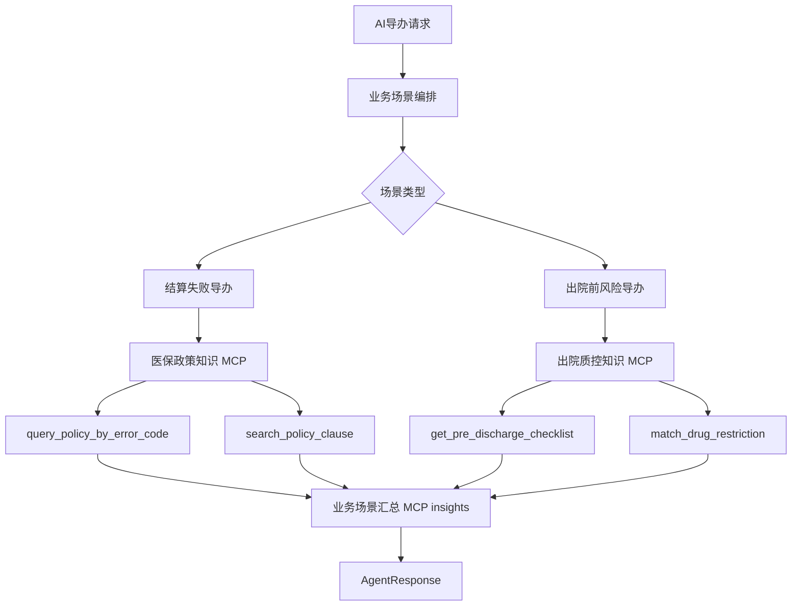

# MCP Server 与 Tool 边界调整设计

## 背景

当前内置演示将 `explain_settlement_error` 和 `pre_discharge_risk_supplement` 注册为 MCP tools。该粒度偏业务编排，更接近 Agent skill 或业务场景能力，而不是 MCP tool。合理的 MCP tool 应更原子，表达为可复用的查询、检索、匹配或读取能力。

## 目标

将 MCP 演示能力调整为两个独立 MCP Server，并在每个 Server 下展示原子化 tools：

1. 医保政策知识 MCP Server：面向医保政策、错误码、规则条款检索。
2. 出院质控知识 MCP Server：面向出院前质控清单、规则项、风险提示查询。

AI 导办仍可以在结算失败和出院前风险两个场景中体现 MCP 调用，但表达方式应从“调用一个业务 skill”调整为“业务场景编排多个原子 MCP tool 的结果”。

## 分层定义

### MCP Server

MCP Server 是一组同类工具的宿主，按知识域或外部系统边界划分，而不是按单个业务场景划分。

- `medical-insurance-policy-knowledge-mcp`：医保政策知识 MCP。
- `pre-discharge-qc-knowledge-mcp`：出院质控知识 MCP。

### MCP Tool

MCP Tool 是原子能力，应满足以下约束：

- 输入明确。
- 输出可复用。
- 不直接表达完整业务导办流程。
- 不包含跨步骤决策编排。
- 低风险工具只读，不产生外部副作用。

### Skill / 业务场景

Skill 或业务场景负责组合多个 tool 输出，形成面向用户的导办建议。

- “为什么结算失败”属于业务场景。
- “出院前有哪些风险”属于业务场景。
- `query_policy_by_error_code`、`get_pre_discharge_checklist` 才是 MCP tool。

## 目标 MCP Server 与 Tools

### 医保政策知识 MCP Server

Server：`medical-insurance-policy-knowledge-mcp`

Tools：

1. `query_policy_by_error_code`
   - 输入：`error_code`
   - 输出：错误码解释、政策依据、处置提示。
   - 用途：结算失败导办中解释医保接口错误码。

2. `search_policy_clause`
   - 输入：`keyword`、`scenario`
   - 输出：命中的政策条款摘要。
   - 用途：按关键词补充政策来源。

### 出院质控知识 MCP Server

Server：`pre-discharge-qc-knowledge-mcp`

Tools：

1. `get_pre_discharge_checklist`
   - 输入：`patient_id`、`encounter_id`
   - 输出：出院前检查项清单。
   - 用途：出院前质控导办中补充标准检查项。

2. `match_drug_restriction`
   - 输入：`drug_name`、`diagnosis_code`
   - 输出：限制用药匹配结果。
   - 用途：出院前风险导办中补充限制用药提示。

## 数据流

## API 与页面展示

后端需要补充 capability 列表接口，页面展示结构改为：

1. MCP Server 列表。
2. 每个 Server 卡片下展示该 Server 的 MCP Tools。
3. Tool 展示字段包括：名称、类型、风险等级、适用场景、描述。

推荐接口：

- `GET /api/v1/medical-insurance-ai-agent/mcp/servers`
- `GET /api/v1/medical-insurance-ai-agent/mcp/capabilities`
- `GET /api/v1/medical-insurance-ai-agent/mcp/servers/{server_id}/capabilities`

## 迁移策略

1. 保留 `McpCapability` 模型，但重新定义内置 demo 数据。
2. 删除或弃用旧 capability：`cap-explain-settlement-error`、`cap-pre-discharge-risk-supplement`。
3. 新增四个原子 capability。
4. AI 导办响应中仍保留 `result.mcp_insights`，但每条 insight 应展示原子 tool 名称和来源 server。

## 非目标

- 不实现外部 MCP 协议真实网络调用。
- 不引入写操作 MCP tool。
- 不让 MCP tool 替代现有业务场景编排。
- 不把 tool 命名成完整业务问题。

## 验证标准

- PostgreSQL 中 `mcp_servers` 至少有两个 demo server。
- PostgreSQL 中 `mcp_capabilities` 至少有四个 demo tools。
- MCP 管理页面先展示 Server，再在 Server 下展示 Tools。
- 结算失败导办展示来自 `query_policy_by_error_code` 或 `search_policy_clause` 的 MCP insight。
- 出院前风险导办展示来自 `get_pre_discharge_checklist` 或 `match_drug_restriction` 的 MCP insight。
