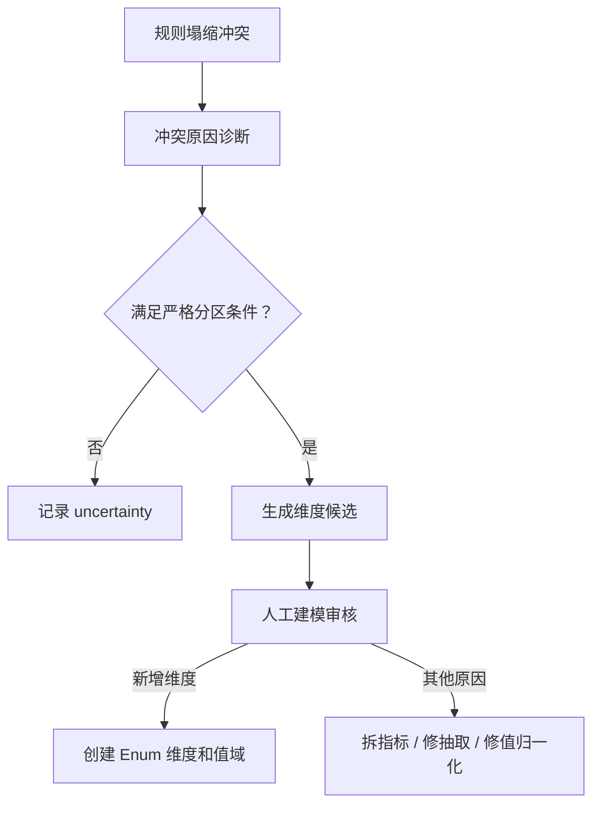
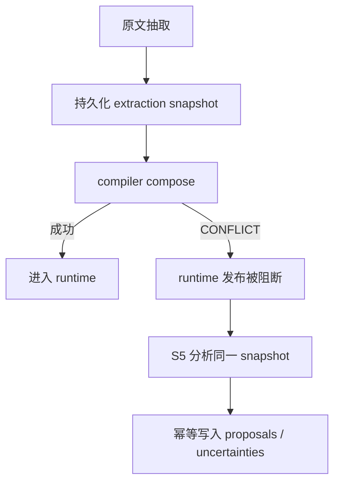

# S5 冲突诊断与缺失维度候选发现设计

**版本**: 1.0 | **日期**: 2026-08-14 | **状态**: 待评审

> **本设计取代** `docs/superpowers/specs/2026-08-12-semantic-layer-metric-value-proactive-discovery-design.md` §4.8「S5 冲突分区维度发现」及其中 §5.3 / §12 与 S5 相关的实施条款，是 S5 的**唯一实现依据**。
> **修订方向**：不推翻 S5，而是把它从「自动发现新轴」调整为「**冲突诊断 + 缺失维度候选生成 + 人工建模裁决**」——既保留「从规则冲突主动发现语义缺口」的核心价值（Issue #13 所要求），又不会把文本相关性误当成业务事实。
> **标注说明**：`[决策]` = 讨论确认的设计决策；`[来源]` = 引用现有代码/文档；`[推断]` = 基于约束的合理推断。

---

# S5 冲突诊断与缺失维度候选发现设计

## 一、设计结论

S5 不直接认定发现了新轴，而是完成三件事：



核心定位：

* compiler 继续负责 fail-closed；
* S5 读取相同 extraction snapshot，分析冲突；
* S5 输出的是 `DimensionCandidateProposal`，不是正式指标；
* 审核人最终决定是新增维度、拆分指标，还是修复抽取；
* 不调用额外 LLM；
* 不自动发布；
* 全过程可重放、可解释、可幂等。

---

# 二、核心概念调整

## 2.1 TriggerSource 保留

```python
class TriggerSource(str, Enum):
    SELF_REPORTED = "self_reported"
    CONFLICT_PARTITION = "conflict_partition"
```

`CONFLICT_PARTITION` 只表示：

> 该提议由规则冲突分区分析触发。

不表示系统已经证明新维度一定成立。

---

## 2.2 Proposal 类型独立

不要直接把信号转换为 `CreateMetricDraft`。

新增：

```python
class ProposalKind(str, Enum):
    NEW_DIMENSION = "new_dimension"
```

提议模型：

```python
class DimensionCandidateProposal(BaseModel):
    proposal_kind: Literal[ProposalKind.NEW_DIMENSION]
    trigger_source: Literal[TriggerSource.CONFLICT_PARTITION]

    suggested_name: str | None
    suggested_code: str | None

    semantic_type: Literal["Enum"] = "Enum"
    metric_role: Literal["dimension"] = "dimension"

    candidate_values: list["CandidateDomainValue"]
    evidence: "ConflictPartitionEvidence"

    evidence_grade: Literal[
        "single_observation",
        "repeated_within_document",
        "independent_confirmation",
    ]

    naming_status: Literal[
        "resolved",
        "manual_required",
    ]

    status: Literal["proposed"] = "proposed"
```

这里明确：

* 业务语义是"维度"；
* 当前系统如果统一存入 `semantic_metrics`，可在审核发布时转换成 Enum Metric；
* 在 proposal 阶段不混用 `CreateMetricDraft`。

---

# 三、冲突不直接等于缺轴

S5 首先对冲突进行诊断。

## 3.1 冲突诊断类型

```python
class ConflictDiagnosis(str, Enum):
    MISSING_DIMENSION = "missing_dimension"
    METRIC_SPLIT_REQUIRED = "metric_split_required"
    TEMPORAL_VERSION = "temporal_version"
    VALUE_NORMALIZATION = "value_normalization"
    EXTRACTION_INCOMPLETE = "extraction_incomplete"
    RULE_BINDING_AMBIGUOUS = "rule_binding_ambiguous"
    MULTIPLE_PARTITIONS = "multiple_partitions"
    INSUFFICIENT_EVIDENCE = "insufficient_evidence"
    UNKNOWN = "unknown"
```

只有诊断结果为 `MISSING_DIMENSION`，才能生成维度提议。

其他诊断只进入 uncertainty，不生成新轴。

---

## 3.2 典型诊断规则

| 场景                               | 诊断                       |     是否提议维度 |
| -------------------------------- | ------------------------ | ---------: |
| `90%` 与 `0.9`                    | VALUE_NORMALIZATION      |          否 |
| 2025 年 90%，2026 年 80%            | TEMPORAL_VERSION         |          否 |
| "支付比例"与"最高支付限额"                  | METRIC_SPLIT_REQUIRED    |          否 |
| entity 只有段落级归属，无法关联具体 rule value | RULE_BINDING_AMBIGUOUS   |          否 |
| 基金归属与值形成唯一严格分区                   | MISSING_DIMENSION        |          是 |
| 基金归属和政策年份都能完美分区                  | MULTIPLE_PARTITIONS      |          否 |
| 每个值只有一条规则                        | MISSING_DIMENSION，但证据等级低 | 可提议、必须人工审核 |

---

# 四、完整处理流程

## 4.1 输入前提

S5 输入必须是一个已经持久化的 extraction snapshot：

```python
class ExtractionRule:
    rule_id: str
    document_id: str
    snapshot_id: str

    rule_type: str
    rule_value: Any
    rule_unit: str | None

    insu_type: str | None
    med_type: str | None
    psn_type: str | None
    hosp_lv: str | None
    setl_type: str | None

    effective_start: date | None
    effective_end: date | None
    region_code: str | None

    entities: list[Entity]
    relations: list[Relation]

    source_clause_id: str
    evidence_text: str
```

关键要求：

> entities 必须是 rule 级实体，或者能够通过 relation 明确关联到当前 rule value。

如果目前 entities 只是段落级公共列表，S5 不得根据它直接产生维度提议。

---

## 4.2 Step 1：规则值归一化

在识别多值冲突前，先统一值。

```python
class CanonicalRuleValue:
    semantic_type: Literal[
        "percentage",
        "amount",
        "integer",
        "range",
        "formula",
        "text",
    ]
    canonical_value: str
    canonical_unit: str | None
    raw_value: str
```

示例：

| 原值        | 归一化值                |
| --------- | ------------------- |
| `90%`     | `percentage:0.90`   |
| `0.9`     | `percentage:0.90`   |
| `百分之九十`   | `percentage:0.90`   |
| `50万元`    | `amount:500000:CNY` |
| `500000元` | `amount:500000:CNY` |

处理规则：

* 归一化后相同，不构成冲突；
* 不同 semantic type 不进入维度发现；
* 单位无法识别时，记 `VALUE_NORMALIZATION`；
* 公式与常量不能直接作为同一多值组比较。

---

## 4.3 Step 2：身份签名构建

保留原来的六个核心字段，但补充必要的规则身份信息。

```python
IDENTITY_FIELDS = (
    "rule_type",
    "insu_type",
    "med_type",
    "psn_type",
    "hosp_lv",
    "setl_type",
    "region_code",
    "effective_start",
    "effective_end",
    "value_semantic_type",
    "canonical_unit",
)
```

签名不能把空串当成普通值，而要保存缺失状态：

```python
class IdentitySignature:
    known_values: dict[str, str]
    unknown_fields: tuple[str, ...]
```

例如：

```json
{
  "known_values": {
    "rule_type": "支付比例",
    "insu_type": "职工医保",
    "value_semantic_type": "percentage"
  },
  "unknown_fields": [
    "hosp_lv",
    "setl_type"
  ]
}
```

分组规则：

1. `known_values` 必须完全一致；
2. `unknown_fields` 缺失模式必须一致；
3. 同一文档、同一 extraction snapshot 内分组；
4. 有效期明确不同时，不进入同组；
5. 空字段组可以进入冲突诊断，但降低证据等级。

这样既不会完全丢失缺字段样本，也不会把空串宣称为"确定相同"。

---

## 4.4 Step 3：识别多值候选组

```python
def group_conflict_candidates(
    rules: list[ExtractionRule],
) -> list[ConflictCandidateGroup]:
    ...
```

筛选条件：

```text
同一身份签名
AND 归一化后 distinct value >= 2
AND value semantic type 相同
AND canonical unit 相同
```

输出：

```python
class ConflictCandidateGroup:
    identity_signature: IdentitySignature
    rules: list[ExtractionRule]
    distinct_values: list[CanonicalRuleValue]
```

此时只能叫"冲突候选组"，不能叫"缺失维度组"。

---

# 五、候选分区短语提取

## 5.1 不再直接依赖最长公共子串

改为两阶段拆分：

```text
实体名称
  ↓
识别公共指标核心词
  ↓
剩余部分作为分类限定词
```

例如：

| entity.name    | 指标核心 | 分类限定词      |
| -------------- | ---- | ---------- |
| 基本医疗保险统筹基金支付比例 | 支付比例 | 基本医疗保险统筹基金 |
| 大额医疗互助资金支付比例   | 支付比例 | 大额医疗互助资金   |

指标核心词由语义层维护的确定性词表提供：

```text
支付比例
最高支付限额
起付标准
报销金额
个人自付比例
基金支付金额
```

不能识别指标核心时：

* 可以记录原始 entity；
* 不能直接生成维度提议；
* 诊断为 `EXTRACTION_INCOMPLETE`。

最长公共前缀/后缀只能作为辅助，不作为主要语义判断依据。

---

## 5.2 只读取有规则归属的实体

候选来源优先级：

1. 与当前 rule value 有明确 relation 的 entity；
2. 当前 rule 独占的 AMOUNT/SERVICE/RATIO entity（RATIO 为提取契约 prompt 中比例度量实体的标注类型，如「大额医疗互助资金支付比例」）；
3. relation 的 subject/object；
4. predicate 只用于识别关系，不单独作为值域。

禁止直接使用：

* 段落内所有 entity；
* 只有 predicate、没有 subject/object 的 relation；
* 同时属于多个 rule value、但无法区分归属的 entity。

---

## 5.3 候选值规范化

增加轻量、确定性的 `AxisConceptRegistry`：

```yaml
axes:
  fund_type:
    name: 基金归属
    value_aliases:
      pooled_fund:
        label: 统筹基金
        aliases:
          - 基本医疗保险统筹基金
          - 基本医保统筹基金
          - 统筹基金

      large_mutual_aid_fund:
        label: 大额医疗互助资金
        aliases:
          - 大额医疗互助资金
          - 大额互助资金
```

它不是正式维度注册表，而是业务概念和别名词典。

作用：

* 规范化候选值；
* 给出 `suggested_name`；
* 给出 `suggested_code`；
* 不代表正式维度已经存在。

如果候选值不能命中 AxisConceptRegistry：

```text
suggested_code = null
naming_status = manual_required
```

仍然可以生成候选，但由审核人命名。

---

# 六、严格分区判定

## 6.1 不再返回 bool

```python
def evaluate_partition(
    group: ConflictCandidateGroup,
    candidates: list[PartitionCandidate],
) -> PartitionEvaluation:
    ...
```

返回：

```python
class PartitionEvaluation:
    candidate_axis_code: str | None
    candidate_axis_name: str | None

    mappings: list["PartitionMapping"]

    coverage: Decimal
    exclusivity: Decimal

    value_count: int
    phrase_count: int
    support_per_phrase: dict[str, int]

    uncovered_rule_ids: list[str]
    ambiguous_rule_ids: list[str]
    competing_axis_candidates: list[str]

    diagnosis: ConflictDiagnosis
    eligible_for_proposal: bool
```

映射证据：

```python
class PartitionMapping:
    canonical_phrase: str
    display_phrase: str
    canonical_value: str
    rule_ids: list[str]
    source_entity_ids: list[str]
```

---

## 6.2 严格分区条件

只有同时满足以下条件，才判为 `MISSING_DIMENSION`：

1. 每条规则恰好命中一个候选分类值；
2. 同一个候选分类值只能对应一个 rule value；
3. 每个 rule value 至少对应一个候选分类值；
4. 候选分类值数量等于 distinct value 数量；
5. `coverage == 1.0`；
6. `exclusivity == 1.0`；
7. 不存在两个同样成立的竞争轴；
8. 候选实体与当前 rule value 归属明确；
9. 指标核心语义一致；
10. 不存在明显时间版本差异。

形式化表达：

```text
phrase → value 必须是函数
value → phrase 也必须是函数
```

如果一条规则同时出现：

```text
统筹基金和大额医疗互助资金……
```

且无法判断 90% 属于哪个基金，则不满足排他性。

---

## 6.3 证据等级

严格分区只决定"能不能提议"，证据等级决定审核提示。

| 等级                       | 条件            | 处理           |
| ------------------------ | ------------- | ------------ |
| single_observation       | 每个候选值仅有 1 条规则 | 允许提议，明确提示样本弱 |
| repeated_within_document | 每个候选值至少 2 条规则 | 正常提议         |
| independent_confirmation | 后续被其他文档独立验证   | 强证据，v1 暂不实现  |

不使用虚假的 `0.93` 置信度，采用可解释的证据等级。

---

# 七、多种完美分区如何处理

假设两条规则同时存在：

| 规则 |   年份 | 基金     |  比例 |
| -- | ---: | ------ | --: |
| A  | 2025 | 统筹基金   | 90% |
| B  | 2026 | 大额互助资金 | 80% |

年份和基金都能一一分区。

这时不能任选基金，而应返回：

```text
diagnosis = MULTIPLE_PARTITIONS
eligible_for_proposal = false
competing_axis_candidates = [policy_year, fund_type]
```

进入 uncertainty，由审核人判断，避免把偶然相关当成维度。

---

# 八、证据模型

不要在通用 `DiscoveryEvidence` 上继续堆可空字段，改为判别联合类型。

```python
class ConflictPartitionEvidence(BaseModel):
    trigger_source: Literal[TriggerSource.CONFLICT_PARTITION]

    document_id: str
    extraction_snapshot_id: str
    extraction_contract_version: str

    identity_signature: IdentitySignature
    conflict_values: list[CanonicalRuleValue]

    partition_mappings: list[PartitionMapping]

    coverage: Decimal
    exclusivity: Decimal
    evidence_grade: str

    rule_ids: list[str]
    source_clause_ids: list[str]

    unknown_identity_fields: list[str]
    competing_axis_candidates: list[str]
```

然后：

```python
DiscoveryEvidence = Annotated[
    SelfReportedEvidence | ConflictPartitionEvidence,
    Field(discriminator="trigger_source"),
]
```

这样每种触发来源拥有自己的强校验，不需要大量：

```python
identity_signature: Optional[...]
conflict_values: Optional[...]
```

---

# 九、提议生成

## 9.1 纯函数入口

```python
def discover_conflict_partitions(
    rules: list[ExtractionRule],
    axis_registry: AxisConceptRegistry,
    measure_registry: MeasureConceptRegistry,
) -> DiscoveryReport:
    ...
```

返回：

```python
class DiscoveryReport:
    proposals: list[DimensionCandidateProposal]
    uncertainties: list[ConflictUncertainty]
```

整个函数：

* 不访问数据库；
* 不调用 LLM；
* 不写 proposal；
* 同一输入必定得到同一输出；
* 可以使用 fixture 完整测试。

---

## 9.2 fund_type 样例输出

在 rule 与 entity 归属明确的情况下：

```json
{
  "proposal_kind": "new_dimension",
  "trigger_source": "conflict_partition",
  "suggested_name": "基金归属",
  "suggested_code": "fund_type",
  "semantic_type": "Enum",
  "metric_role": "dimension",
  "candidate_values": [
    {
      "code": "pooled_fund",
      "label": "统筹基金",
      "aliases": [
        "基本医疗保险统筹基金"
      ]
    },
    {
      "code": "large_mutual_aid_fund",
      "label": "大额医疗互助资金",
      "aliases": [
        "大额互助资金"
      ]
    }
  ],
  "evidence_grade": "single_observation",
  "naming_status": "resolved",
  "status": "proposed"
}
```

如果没有命中概念词典：

```json
{
  "suggested_name": null,
  "suggested_code": null,
  "naming_status": "manual_required"
}
```

审核人填写名称和 code。

---

# 十、审核页面设计

审核页面不能只展示"建议新增 fund_type"，需要同时展示建模替代方案。

## 10.1 页面结构

### 左侧：为什么产生冲突

* 文档；
* 规则类型；
* 身份签名；
* 未知身份字段；
* 冲突值；
* 原文条款；
* rule ID；
* extraction snapshot。

### 中间：为什么怀疑缺少维度

| 候选值      | 对应规则值 | 规则数 | 原文证据 |
| -------- | ----: | --: | ---- |
| 统筹基金     |   90% |   1 | ……   |
| 大额医疗互助资金 |   80% |   1 | ……   |

同时显示：

* 覆盖率；
* 排他性；
* 证据等级；
* 是否存在竞争分区；
* entity 与 rule value 的关系证据。

### 右侧：审核结论

审核人必须选择一个建模结论：

1. 新增分类维度；
2. 拆分为多个指标；
3. 属于政策版本差异；
4. 修正规则值；
5. 修复抽取结果；
6. 证据不足，暂不处理；
7. 驳回。

这一步非常重要：S5 不应该把审核人逼进"通过/驳回新轴"二选一。

---

# 十一、审核发布行为

选择"新增分类维度"后，才调用正式创建命令：

```python
CreateMetricDraft(
    code="fund_type",
    name="基金归属",
    metric_role="dimension",
    semantic_type="Enum",
    indexed=True,
)
```

同时创建：

```text
semantic_value_domains
- pooled_fund / 统筹基金
- large_mutual_aid_fund / 大额医疗互助资金
```

并保存：

* proposal_id；
* 来源 rule_ids；
* source clauses；
* aliases；
* extraction snapshot；
* 审核人；
* 审核结论；
* 发布时间。

发布后：

1. 语义契约版本递增；
2. 后续抽取立即读取新版本；
3. 原文档进入"建议重抽"队列；
4. 不在当前事务中静默重抽历史文档；
5. 由审核人确认或由独立任务重抽。

---

# 十二、构建流程接入

不要只挂在 REBUILD 代码分支，应挂在"抽取快照完成"这个统一阶段。



推荐流程：

```python
snapshot = extraction_service.extract_and_persist(document)

compile_result = compiler.compose(snapshot.rules)

if compile_result.has_conflict:
    report = discover_conflict_partitions(
        snapshot.rules,
        axis_registry,
        measure_registry,
    )
    proposal_intake.upsert(report)
```

适用于：

* 首次抽取；
* 强制重抽；
* 单文档重建；
* 人工修正后重新编译。

---

# 十三、幂等与生命周期

## 13.1 Proposal fingerprint

```text
fingerprint =
hash(
    document_id
    + normalized_identity_signature
    + sorted(conflict_values)
    + sorted(partition_values)
    + proposal_kind
)
```

同一冲突重复 rebuild：

* 不创建重复 proposal；
* 更新 `last_observed_at`；
* 保存新的 evidence version。

状态建议：

```text
proposed
approved
rejected
stale
superseded
```

规则变化后：

* 原冲突不再出现：标记 `stale`；
* 候选值发生变化：旧提议 `superseded`，生成新版本；
* 已审核通过的 proposal 不自动撤销正式维度，只产生治理提醒。

---

# 十四、重新规划 TDD Task

## Task 0：冻结真实样本与语义前提

先为 `doc_7a1fbf7480d4` 保存冻结的 extraction fixture，明确：

* 哪两条 rule；
* entity 是否属于 rule 级；
* entity 如何关联 rule value；
* `最高支付限额` 和 `支付比例` 是否混绑；
* 原始值和单位；
* 身份字段缺失情况。

如果只有段落级 entity，先修 extraction binding，不让 S5 猜归属。

---

## Task 1：证据模型与触发枚举

测试：

* `TriggerSource.CONFLICT_PARTITION` 存在；
* ConflictPartitionEvidence 缺签名时失败；
* 缺冲突值时失败；
* 缺 partition mapping 时失败；
* 不同 evidence 类型不能混填。

实现：

* 判别联合 `DiscoveryEvidence`；
* `DimensionCandidateProposal`；
* `ConflictDiagnosis`。

---

## Task 2：规则值归一化

测试：

* `90% == 0.9`；
* `50万元 == 500000元`；
* 不同单位不直接形成冲突；
* 公式与常量不混组；
* 真正的 `90% != 80%`。

---

## Task 3：身份分组

测试：

* 同身份不同值形成候选组；
* 缺失模式不同不分组；
* 两条规则都缺 `hosp_lv` 时可以进入诊断，但记录 unknown；
* 有效期不同不分组；
* value type 不同不分组。

---

## Task 4：实体核心与分类限定词拆分

测试：

```text
基本医疗保险统筹基金支付比例
→ measure_core=支付比例
→ qualifier=基本医疗保险统筹基金
```

以及：

```text
基本医疗保险统筹基金最高支付限额
大额医疗互助资金支付比例
```

指标核心不一致，诊断为 `METRIC_SPLIT_REQUIRED`。

其他测试：

* concept registry 别名归一；
* rule value 归属不明确时不提议；
* predicate 不能单独成为值域；
* entity 缺失时只记录 uncertainty。

---

## Task 5：严格分区评估

测试：

* 一一对应分区通过；
* 同一短语对应两个值失败；
* 一条规则包含两个短语失败；
* 有未覆盖规则失败；
* 基金和年份同时完美分区时失败；
* 每值一条规则输出 `single_observation`；
* 每值两条以上输出 `repeated_within_document`。

---

## Task 6：维度候选生成

测试：

* fund_type 命中 AxisConceptRegistry；
* 产出 Enum + dimension；
* 值域包含 label、code、aliases；
* 未命中 registry 时 code 为空；
* 不合格 partition 只进入 uncertainties；
* 不直接调用 `CreateMetricDraft`。

---

## Task 7：Intake 幂等

测试：

* 同一 report 重复提交只产生一条 proposal；
* rebuild 后更新 `last_observed_at`；
* 证据变化生成 evidence version；
* 冲突消失后标记 stale；
* 已 rejected 的相同证据不重复生成。

---

## Task 8：构建流程接入

测试：

* 首次抽取出现 conflict 时触发；
* rebuild 出现 conflict 时触发；
* compiler fail-closed 不影响 S5 读取 snapshot；
* runtime 不接收冲突规则；
* S5 异常不改变 compiler 的安全结论；
* proposal 写入失败可以安全重试。

---

## Task 9：真实 PostgreSQL 集成

分成两个测试。

### 测试 A：确定性集成测试

输入冻结 extraction fixture：

```text
doc_7a1fbf7480d4
```

期望：

* 一条 `NEW_DIMENSION` proposal；
* suggested_code=`fund_type`；
* semantic_type=`Enum`；
* metric_role=`dimension`；
* status=`proposed`；
* evidence_grade 根据样本数确定；
* 冲突值 `{0.90, 0.80}`；
* 候选值 `{统筹基金, 大额医疗互助资金}`；
* 包含 rule IDs、clause IDs、snapshot ID。

### 测试 B：真实重抽链路验收

```text
政策原文 → LLM extraction → compiler → S5
```

这个测试不作为严格 CI 门禁，只用于验证当前抽取模型能否稳定提供：

* rule 级 entity；
* rule value 归属；
* 正确 measure core；
* 基金限定词。

如果失败，应修 extraction contract，不修改 S5 去猜测。

---

# 十五、V1 明确不做

* 不自动发布维度；
* 不根据中文自动发明英文 code；
* 不做 80% 模糊分区；
* 不在多个竞争分区中自动选一个；
* 不用段落级 entity 猜 rule 归属；
* 不跨文档聚合；
* 不把 LLM 重抽结果作为稳定单元测试输入；
* 不自动修 compiler；
* 不自动重抽全部历史政策；
* 不把所有冲突都解释成缺失维度。

---

# 十六、最终验收标准

V1 上线应满足：

1. compiler 仍然严格 fail-closed；
2. S5 对同一 extraction snapshot 输出完全一致；
3. 值归一化后才判断冲突；
4. 空字段被显式记录，不伪装成已知相同；
5. 只有唯一、完整、排他的分区才能产生维度候选；
6. 每值只有一条规则时明确标记弱证据；
7. 竞争分区不自动提议；
8. proposal 重复构建幂等；
9. 审核人可以选择"新增维度"之外的冲突原因；
10. 只有审核通过后才创建正式 Enum 维度和值域；
11. 正式维度保留 proposal、rule、条款和文档级血缘；
12. `doc_7a1fbf7480d4` 在证据绑定正确的前提下产出 `fund_type` 候选。

这版真正能落地的关键，是把系统承诺收敛为：

> **S5 不负责证明业务世界中一定存在某个新轴；它负责从冲突中找出具有严格共现证据的维度候选，并把完整证据交给审核人做最终本体建模裁决。**

这样既保住了 Issue #13 所要求的"主动发现"，又不会让语义层被偶然相关性反向污染。
