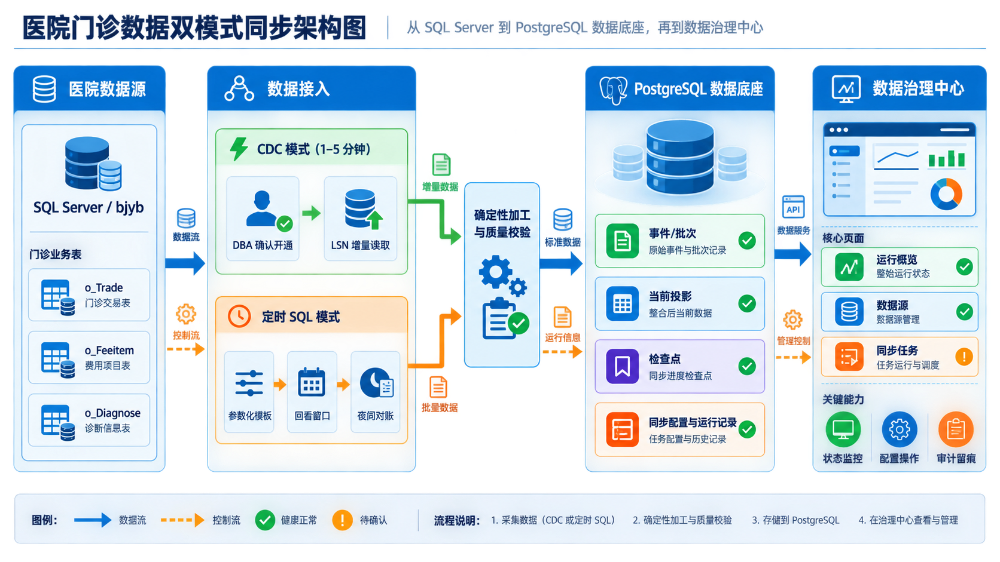
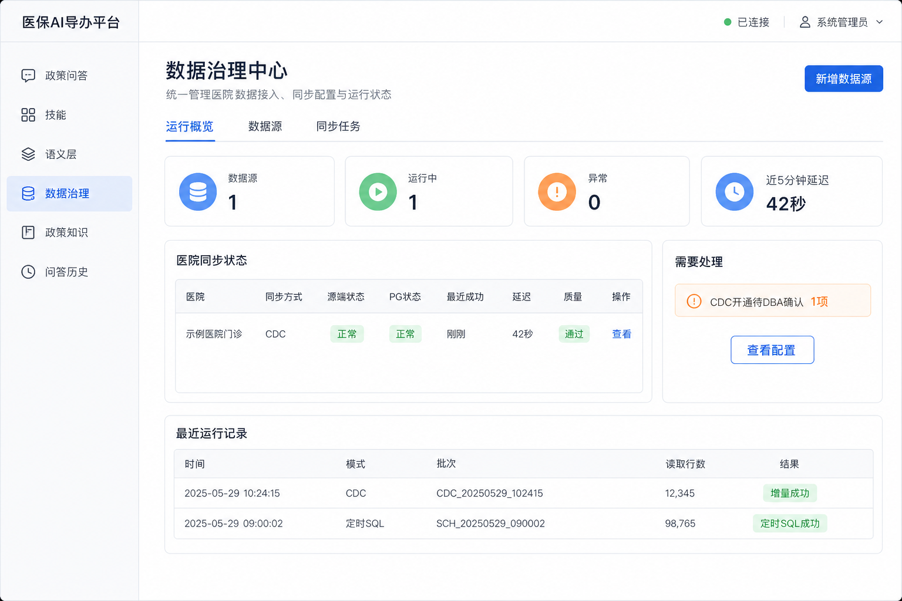

# 门诊数据治理中心与双模式同步设计

日期：2026-08-31

状态：对话设计已确认，待书面复核与实施计划

目标用户：医院医保办经办/运营人员、系统管理员、医院 DBA

首期范围：一家医院门诊，可扩展为多医院配置；SQL Server 源、PostgreSQL 落地；CDC 与定时 SQL 二选一

## 1. 决策摘要

1. SQL Server 是医院业务源，PostgreSQL 是平台统一落地库；本期不为 PostgreSQL 额外开启逻辑复制或下游 CDC。[来源: 2026-08-31 用户确认]
2. 新建独立“数据治理中心”，不把同步配置继续塞入语义发现页。首版只包含“运行概览、数据源、同步任务”三个页签。[来源: 2026-08-31 用户选择独立治理中心并确认首版范围]
3. 每家医院的门诊同步任务在 `cdc` 与 `scheduled_sql` 之间二选一，两种模式共用确定性加工、质量校验、PostgreSQL 原子发布和语义查询模型。[来源: 2026-08-31 用户确认]
4. 页面可以配置连接、凭据、模式、周期、回看窗口、启停和立即执行，但不能直接执行 `sys.sp_cdc_enable_db/table`。CDC 开通脚本由平台生成或下载，数据库级变更必须等待医院 DBA 确认。[来源: 2026-08-31 用户确认；项目 `AGENTS.md` 高风险动作约束]
5. 不允许 CDC 的医院使用受控参数化 SQL 模板，不开放任意 SQL 文本输入。默认每 5 分钟读取、回看 2 小时，并在夜间对最近 30 天做分区对账。[来源: 2026-08-31 用户确认]
6. SQL Server 密码只在创建或轮换凭据时提交一次，后端使用主密钥认证加密保存；页面、读取 API、日志和审计记录永不回显。现有语义发现页把密码写入 `localStorage` 的方式必须退役。[来源: 2026-08-31 用户确认；`src/apps/portal/app/semantic-layer/discovery/page.tsx`]
7. 首版继续使用独立常驻同步 worker 和 PostgreSQL 任务状态，不引入 Celery、RabbitMQ 或新的分布式调度基础设施。[来源: 2026-08-31 用户确认；建议]

## 2. 背景与现有基线

门诊 P1 已形成以下代码基线：

- SQL Server 三表 CDC 开通脚本：`scripts/enable_outpatient_cdc.sql`；
- SQL Server CDC 只读适配器：`src/adapters/insurance_interface/outpatient_cdc.py`；
- 确定性加工服务：`src/data_platform/outpatient_sync.py`；
- PostgreSQL 事件、批次、检查点和当前投影：`src/data_platform/storage/postgresql/outpatient_store.py`；
- 单次/循环同步与状态 CLI：`scripts/run_outpatient_cdc_sync.py`；
- 已发布语义查询模型使用 `mz_trade` 与 `mz_fee_item`。[来源: `docs/reviews/2026-08-28-outpatient-p1-verification.md`]

当前缺口：

- `bjybdb` 尚无可用的真实 SQL Server 连接配置，无法完成目标医院 CDC 验收；
- CDC 配置和运行状态只能通过脚本/CLI 查看，Portal 没有控制面；
- 同步服务和表名仍以 CDC 专用概念为主，不能正确表达定时 SQL；
- 数据源注册表只支持注册/启停，连接配置包含敏感字段，且语义发现页仍把密码保存到浏览器；
- worker 只支持单一 `source_id` 和固定循环间隔，没有持久化任务调度、失败记录或页面操作。[来源: 上述现有代码]

## 3. 目标与非目标

### 3.1 目标

1. 在 Portal 中统一查看医院 SQL Server、平台 PostgreSQL、CDC 开通、同步运行、新鲜度和数据质量状态。
2. 系统管理员可在页面配置医院数据源、一次性提交/轮换凭据、检测连接、选择同步模式并控制任务。
3. CDC 模式在源端变化后 1～5 分钟内发布可查询数据。
4. 不允许 CDC 的医院可用定时 SQL 完成初始装载、重叠窗口增量读取、幂等发布和夜间对账。
5. 两种模式使用同一业务口径、同一质量规则、同一 PostgreSQL 当前投影和同一语义版本。
6. 配置、运行、故障恢复和回滚都有可复核文档与审计证据。

### 3.2 非目标

- 不从应用进程直接开启或关闭 SQL Server CDC；
- 不开放用户输入任意 SQL、表名、列名或 JOIN；
- 不建设通用 ETL 编排平台、可视化 SQL 设计器或多数据库复制产品；
- 不引入 Celery、Kafka、RabbitMQ、Debezium 或新的 OLAP 集群；
- 不在本期支持 PostgreSQL 逻辑复制、跨平台下游订阅或双向同步；
- 不自动把 CDC 失败切换为定时 SQL；
- 不在配置和状态页面展示患者数据、原始 SQL、数据库连接串或密码。

## 4. 设计图

### 4.1 双模式同步架构



### 4.2 数据治理中心运行概览



图中的医院、时间、行数和批次号均为设计占位；正式页面只读取真实 API 状态，不提供示例数据回退。

## 5. 总体架构

```text
医院 SQL Server / bjyb
  ├── CDC 适配器
  │     ├── 固定 capture instance
  │     ├── LSN 检查点
  │     └── 保留期断档检测
  └── 定时 SQL 适配器
        ├── 固定参数化模板
        ├── 就诊时间重叠窗口
        └── 分区对账
             ↓
       门诊变更批次（来源中立）
             ↓
  确定性加工 + 质量校验 + 原子发布
             ↓
PostgreSQL
  ├── 数据源/凭据/任务/尝试记录
  ├── 同步批次与检查点
  ├── 门诊当前投影
  └── mz_trade / mz_fee_item
             ↑
常驻同步 worker ←→ 数据治理 API ←→ Portal 数据治理中心
```

外部 SQL Server 连接继续经过适配器/防腐层；Portal 只调用受控 API。模型不参与同步模式选择、SQL 编译、质量判断或状态判定。

## 6. 产品信息架构

顶级导航新增“数据治理”，路径前缀为 `/data-governance`。它属于治理与支撑工作台，不是新的医保业务入口；`/policy-qa` 仍是唯一业务入口。[来源: `src/apps/portal/AGENTS.md`]

三个页签分别使用 `/data-governance`、`/data-governance/data-sources` 和 `/data-governance/sync-jobs`，复用 Portal 现有顶级侧栏和页签布局，不另建第二套壳层。

### 6.1 运行概览

顶部状态卡：

- 数据源数量；
- 运行中任务数量；
- 异常/待处理数量；
- 最新同步延迟。

医院同步状态表按数据源展示：医院、同步方式、源端状态、PG 状态、最近成功、延迟、质量和操作。右侧“需要处理”只显示可执行事项，例如“CDC 开通待 DBA 确认”“凭据需轮换”“保留期断档需重建基线”。

### 6.2 数据源

表单字段：

- `source_id`：稳定技术标识，创建后不可修改；
- 医院编码、医院名称、数据源名称；
- SQL Server 主机、端口、数据库、schema、用户名；
- 密码：只在创建或轮换时出现；
- 固定业务范围：门诊交易、费用明细、诊断三张表；
- 连接状态、字段契约状态、凭据状态、最近检测时间。

PostgreSQL 目标以只读状态卡展示脱敏端点、连通性、结构完整性和最近检查时间。平台主库连接由部署配置管理，页面不得热切换。

### 6.3 同步任务

每个数据源首期最多一个门诊同步任务。页面展示模式、计划、回看范围、运行状态、下次执行、最近成功、最近错误和最近批次，并提供：

- 保存配置；
- 启用；
- 暂停；
- 立即执行；
- 查看运行记录；
- 切换模式。

模式切换必须执行“暂停旧任务 → 基线核验 → 写入新模式检查点 → 人工确认 → 启用新任务”，不能直接覆盖检查点。

## 7. 状态模型

页面不能用一个“正常/异常”混合所有含义，必须分别展示：

| 维度 | 状态 |
|---|---|
| 连接 | `unknown / healthy / error` |
| CDC 开通 | `not_applicable / not_checked / waiting_dba / ready / invalid` |
| 运行 | `draft / ready / running / paused / degraded / failed` |
| 新鲜度 | `no_data / fresh / stale` |
| 质量 | `complete / warning / blocked` |

新鲜度按最后成功发布时间计算：CDC 默认 5 分钟以内为 `fresh`；定时 SQL 默认不超过“执行周期 + 一个容错周期”为 `fresh`。状态阈值可以由同步任务配置，但不能由前端自行推断。

## 8. 同步模式

### 8.1 CDC 模式

固定源表和 capture instance：

| 源表 | capture instance |
|---|---|
| `dbo.o_Trade` | `dbo_o_Trade` |
| `dbo.o_FeeItem` | `dbo_o_FeeItem` |
| `dbo.o_Diagnose` | `dbo_o_Diagnose` |

开通流程：

```text
保存数据源
  → 连接与字段契约检测
  → 下载受控 CDC 脚本
  → waiting_dba
  → DBA 在目标数据库执行
  → 页面重新检测数据库、capture instance、捕获列和 retention
  → ready
  → 首次快照
  → LSN 增量循环
```

默认轮询间隔 45 秒，允许范围 30～60 秒；产品 SLA 按 1～5 分钟展示。保留期断档时禁止跳过 LSN，任务进入 `degraded`，等待管理员重建基线。

### 8.2 定时 SQL 模式

默认配置：

- 执行周期：5 分钟；
- 增量回看窗口：2 小时；
- 夜间对账：每天一次；
- 对账范围：最近 30 天；
- 增量候选时间字段：`o_Trade.T_TradeDate`，上线前必须用目标医院数据确认其源端含义和索引；它只用于抽取水位，不等同于智能问数面向用户展示的“就诊时间”；
- 明细关联：按读取到的 `T_TradeNo` 批量查询 `o_FeeItem` 与 `o_Diagnose`。

单次运行算法：

1. 没有检查点时执行受控全量或已确认历史范围的首次快照，建立基线；
2. 有检查点后计算 `[now - lookback, now]`，使用固定参数化 SQL 读取交易；
3. 对交易号分批读取费用明细和诊断；
4. 与 PostgreSQL 当前投影比较，生成新增、修改和窗口内删除；
5. 进入与 CDC 相同的确定性加工和质量规则；
6. 在一个 PostgreSQL 事务中写入事件、投影、批次和检查点；
7. 成功后更新下次执行时间，失败时不推进检查点。

定时 SQL 是最终一致方案。页面必须明确提示：超过夜间对账范围的历史修改不能即时发现；医院需要更长追溯时应扩大对账范围并评估源库负载。

## 9. 来源中立批次契约

当前 `OutpatientCdcBatch`、`last_lsn` 等概念需要收口为来源中立契约：

- `source_mode`：`cdc | scheduled_sql`；
- `checkpoint_kind`：`lsn | time_window`；
- `checkpoint_value`：后端私有结构，API 只返回脱敏摘要；
- `changes`：稳定来源键、操作类型、来源时间、有效载荷；
- `window_start/window_end`：定时 SQL 使用；
- `from_lsn/to_lsn`：只由 CDC 适配器使用；
- `source_committed_at`：用于计算真实同步延迟。

公共加工服务只依赖 `changes` 和来源元数据，不读取 CDC 函数。两种模式必须使用稳定事件键和数据库唯一约束保证重放幂等。

## 10. 持久化设计

最小新增或扩展对象：

1. 数据源配置：医院标识、非敏感连接字段、凭据引用、连接/契约检测结果；
2. 数据源凭据：认证加密密文、端点指纹、秘密指纹、修订号、更新人和更新时间；
3. 同步任务：模式、调度、回看/对账配置、运行状态、下次执行时间；
4. 同步尝试：开始/结束、状态、安全错误码、读取行数、发布批次 ID；
5. 现有同步批次、检查点和门诊当前投影继续复用并扩展为来源中立字段。

数据库迁移必须同时覆盖全新库和已有 P1 表：`CREATE TABLE IF NOT EXISTS` 与 `ALTER TABLE ... ADD COLUMN IF NOT EXISTS` 同步维护。[来源: 项目 `AGENTS.md` 已知陷阱]

## 11. API 边界

统一前缀：

`/api/v1/medical-insurance-ai-agent/data-governance`

| 方法与路径 | 用途 |
|---|---|
| `GET /overview` | 概览和待处理事项 |
| `GET /data-sources` | 数据源列表 |
| `POST /data-sources` | 新增数据源与首次凭据 |
| `PATCH /data-sources/{source_id}` | 更新非敏感配置 |
| `PUT /data-sources/{source_id}/credential` | 轮换凭据 |
| `POST /data-sources/{source_id}/test` | 最小连接与字段契约检测 |
| `GET /data-sources/{source_id}/cdc-script` | 下载固定 CDC 脚本 |
| `POST /data-sources/{source_id}/cdc-check` | 检测 CDC 开通状态 |
| `GET /postgresql/status` | 读取目标库状态与结构完整性 |
| `GET /sync-jobs/{source_id}` | 读取同步配置和状态 |
| `PUT /sync-jobs/{source_id}` | 保存同步配置，仅允许在未运行时修改模式 |
| `POST /sync-jobs/{source_id}/start` | 启用任务 |
| `POST /sync-jobs/{source_id}/pause` | 暂停任务 |
| `POST /sync-jobs/{source_id}/run-once` | 请求立即执行一次 |
| `GET /sync-jobs/{source_id}/runs` | 查询成功批次和失败尝试 |

请求和响应使用 Pydantic 模型，不新增裸 `dict` 返回契约。读取 API 不返回密码、密文、连接串、原始 SQL、完整 LSN 或内部异常文本。

## 12. Worker 与调度

常驻 worker 从 PostgreSQL 领取到期任务：

```text
领取到期任务
  → 按 source_mode 建立对应只读适配器
  → 执行一个批次
  → 记录同步尝试
  → 成功：原子发布并计算下次执行时间
  → 失败：保存安全错误码，不推进数据检查点
```

首版不引入 Celery。worker 作为现有工作区服务的一部分由中央 `ws.ps1` 间接启停；禁止页面创建任意进程，也禁止绕过中央脚本手工启动整套服务。[来源: 项目 `AGENTS.md` 启停约束]

## 13. 安全与审计

- 配置写操作只允许现有系统管理员；经办/运营人员只读运行概览和运行记录；
- 数据源密码使用独立主密钥进行认证加密，密钥仅来自服务端环境；
- 凭据与端点指纹绑定，修改主机或数据库后必须重新提交凭据；
- 连接检测只返回 `连接成功 / 认证失败 / 超时 / 字段契约不匹配` 等安全结果；
- CDC DDL 始终进入 `waiting_dba`，页面不得自动执行；
- 任意 SQL 输入被产品和 API 同时禁止；
- 配置、凭据轮换、检测、启停、立即执行和模式切换记录操作者、时间、对象和结果；
- 日志和审计写入前执行敏感信息过滤，不记录患者数据。

## 14. 故障与恢复

| 故障 | 行为 |
|---|---|
| 数据源未配置/凭据缺失 | `draft`，不运行 |
| SQL Server 认证失败 | `failed`，不回显驱动原文 |
| CDC 未开通或配置不完整 | `waiting_dba/invalid`，禁止启动 CDC 任务 |
| CDC retention gap | `degraded`，不推进检查点，等待重建基线 |
| 定时 SQL 单批失败 | 保留上次成功检查点，下次用重叠窗口补读 |
| PostgreSQL 不可用 | 整批回滚，状态页显示目标库异常 |
| 质量阻断 | 保留批次/问题摘要，不发布为当前可查询版本 |
| worker 重启 | 从 PG 任务与检查点继续，不依赖进程内状态 |

系统不得自动从 CDC 切换到定时 SQL，因为两种模式的一致性语义不同。模式切换必须由管理员显式确认。

## 15. 运维文档

实施时新增一份可直接交接的运维手册：

`docs/operations/outpatient-data-sync-configuration.md`

至少包含：

1. SQL Server 版本/权限前置检查、CDC 脚本、capture instance、捕获列、SQL Server Agent、retention 和只读账号；
2. PostgreSQL 连接、初始化、结构检查、备份和恢复要求；
3. 页面字段、状态和 CDC/定时 SQL 选择标准；
4. 主密钥、凭据创建/轮换和禁止泄漏项；
5. worker 启停、健康检查、告警、故障恢复和回滚；
6. 当前环境真实执行结果，以及目标医院仍待完成的事项。

没有可用的目标 SQL Server 连接时，文档必须标记“待目标医院执行”，不得伪造 LSN、批次、时延或成功状态。

## 16. 验证与验收

严格按 Unit → API → Flow 顺序执行。[来源: `src/tests/AGENTS.md`；`docs/governance/TEST-VERIFICATION-MATRIX.md`]

### 16.1 Unit

- 数据源/凭据输入校验和秘密不回显；
- 凭据端点绑定、轮换和解密失败关闭；
- CDC 开通状态检测；
- 定时 SQL 窗口、参数绑定、差异计算和幂等事件键；
- 任务状态转换、到期领取和失败后不推进检查点；
- 概览状态与新鲜度计算。

### 16.2 API

- 权限与未认证访问；
- 数据源创建、编辑、测试和凭据轮换；
- CDC 脚本下载与状态检测；
- 同步任务配置、启停、立即执行和运行记录；
- PostgreSQL 状态与错误脱敏；
- OpenAPI 请求/响应字段一致性。

### 16.3 Flow

- CDC：快照、增量新增/更新/删除、重复执行、断点续传、retention gap；
- 定时 SQL：初始快照、重叠窗口更新、窗口内删除、重复执行、夜间对账；
- 两种模式发布相同门诊事实和质量结果；
- PostgreSQL 中途失败保持上一完整状态；
- Portal：管理员完成配置和启停，经办人员只读查看真实状态。

### 16.4 完成标准

1. 页面可见 SQL Server、PostgreSQL、CDC、任务、延迟、批次和质量状态；
2. 页面可完成确认范围内的所有配置操作，数据库级 CDC DDL 仍由 DBA 执行；
3. 非 CDC 医院可通过定时 SQL 完成可验证同步；
4. API、日志、审计和浏览器存储均不泄漏凭据；
5. 三层测试和 Portal 构建通过；
6. 运维手册记录真实配置与剩余目标环境事项。

## 17. 实施顺序

1. 来源中立批次契约与数据库迁移；
2. 数据源、凭据和同步任务控制面；
3. 定时 SQL 适配器与 worker 调度；
4. 数据治理 API；
5. Portal 独立数据治理中心；
6. 运维手册、三层验证和目标环境记录。

该顺序先保证两种同步模式共享同一条数据链，再建设页面，避免先做出无法反映真实运行状态的静态控制台。

## 18. 设计备选与取舍

曾比较三个页面位置：

1. 继续放入语义发现页：改动最小，但连接、同步和字段发现职责混杂；
2. 作为语义层页签：边界较清楚，但仍把数据接入降格为语义配置；
3. 独立数据治理中心：用户选择。首版用三个页签限制范围，暂不扩展为通用治理平台。[来源: 2026-08-31 用户选择]

调度曾比较“常驻 worker + PostgreSQL”和 Celery。首版选择前者，因为当前任务规模不需要新增消息代理和调度器；当多实例并发领取、队列隔离或大规模横向扩展成为真实需求时再评估 Celery。[建议]
