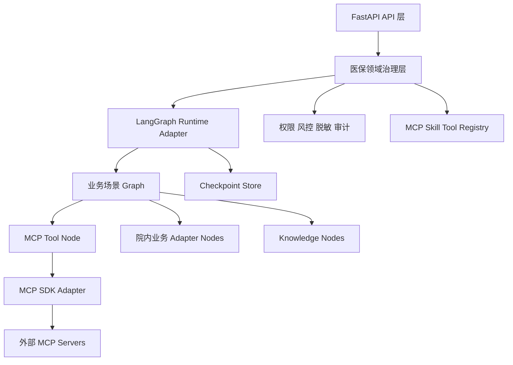
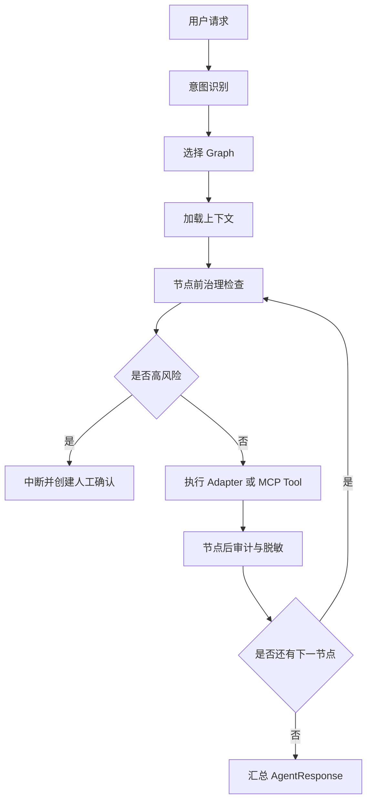

# Design: MCP SDK and LangGraph Adoption

## Context

院端医保智能体当前采用 FastAPI 后端、Next.js 原型前端、Pydantic 契约、内存与 PostgreSQL/Redis 可替换存储端口。MCP 与 skill 管理已经形成基础注册、发现和页面能力，但运行时仍主要依赖手写协议客户端、关键词匹配和业务服务硬编码。

本设计将系统分成三层：

1. 框架运行层：MCP SDK 或 FastMCP 负责协议连接与工具调用，LangGraph 负责状态图编排。
2. 医保治理层：现有注册、权限、风控、脱敏、审计、citations、uncertainties 和人工确认约束。
3. 医保业务层：结算异常导办、出院前联合质控、MCP 工具调用、业务适配器和知识服务。

## Target Architecture

## Decisions

### Decision 1: MCP 协议层采用官方 MCP Python SDK，FastMCP 用于服务端开发加速

优先引入官方 MCP Python SDK 作为客户端协议基础，覆盖 stdio、SSE 和 streamable HTTP 的连接、初始化、工具列表、工具调用和错误语义。FastMCP 可作为自建 MCP Server 的开发框架，用于快速把内部只读能力包装为 MCP Server，但不作为唯一客户端抽象来源。

现有 `StdioMcpClient` 不再继续扩展为完整协议实现。迁移期保留为兼容 fallback 或测试替身，并通过统一 `McpClientAdapter` Protocol 隔离。

### Decision 2: LangGraph 作为 Agent 和 skill 执行运行时

LangGraph 承载多步骤、分支、重试、检查点、人工确认中断和执行轨迹。现有 skill 不再自研执行调度器，而是转换为图模板或图构建配置。

结算异常导办和出院前联合质控分别迁移为可测试的 LangGraph 子图；MCP 工具调用迁移为包含能力匹配、权限评估、工具调用、结果归一化和引用生成的子图。

### Decision 3: 治理逻辑在节点边界强制执行

每个工具节点执行前必须经过能力目录、角色权限、风险等级、最小必要字段和高风险动作检查。每个节点执行后必须输出结构化审计事件，并汇总 citations 或 uncertainties。

高风险节点不直接执行外部动作，而是中断图执行并生成 `waiting_human_confirmation` 状态，交由现有任务闭环服务处理。

### Decision 4: 管理 UI 只作为治理台

前端保留 MCP Server 注册、导入、发现、启停、能力浏览、策略编辑、审计查看和测试调用。不建设拖拽式流程编排、通用 skill 市场或复杂审批后台。

### Decision 5: 分阶段迁移而非重写

现有 API 和业务路径先保持可用，通过 feature flag 或运行时配置选择旧服务路径或 LangGraph 路径。优先迁移 MCP 工具调用链路，再迁移两个医保核心业务场景。

## Runtime Flow

## Proposed Modules

| 模块 | 职责 |
|------|------|
| `runtime/graph_runtime` | LangGraph 运行时适配、图注册、检查点、执行入口 |
| `runtime/graph_runtime/nodes` | 通用节点封装：权限、风控、审计、脱敏、citations 汇总 |
| `knowledge_extension/mcp_registry/client_adapter.py` | MCP SDK 客户端适配器 Protocol 与实现 |
| `knowledge_extension/mcp_registry/sdk_discovery.py` | 基于 MCP SDK 的 server 初始化与 tools/list 发现 |
| `knowledge_extension/mcp_registry/sdk_invocation.py` | 基于 MCP SDK 的 tools/call 调用与错误归一化 |
| `runtime/skill_graphs` | 将现有 skill 元数据映射为 LangGraph 图模板 |
| `business_scenarios/*/graph.py` | 业务场景专属 LangGraph 子图 |

## Data and State

- MCP 注册事实数据仍以 PostgreSQL 为准，Redis/Valkey 承载短期状态、健康状态、限流、幂等和缓存。
- LangGraph checkpoint 短期可用内存或 SQLite/PostgreSQL 实现，生产优先采用 PostgreSQL 或现有持久化端口适配。
- 图执行状态必须记录 workflow_id、task_id、node_id、risk_decision、audit_event、citations 和 uncertainties。

## Security and Compliance

- 所有 MCP tool 默认按外部能力处理，必须具备 risk_level、required_roles、required_permissions、supported_scenarios 和 side effect 标记。
- Tool annotations 中的 destructiveHint、readOnlyHint、idempotentHint 只能作为辅助信息，不可替代院内风控策略。
- 所有患者、费用、病案和医保明细输出前必须经过脱敏或最小必要字段裁剪。
- 无 citations 的确定性结论必须降级为 uncertainties。

## Migration Plan

1. 增加依赖与适配层：引入 MCP SDK、LangGraph，定义 `McpClientAdapter` 与 `GraphRuntime` Protocol。
2. 替换 MCP 发现链路：将 `tools/list` 自动发现切到 MCP SDK adapter，保留现有 fake 和 stdio fallback 测试。
3. 替换 MCP 调用链路：将 MCP 工具调用从关键词匹配服务迁移为 LangGraph 子图。
4. 建立治理节点 wrapper：统一权限、风控、脱敏、审计、citations 和 uncertainties。
5. 迁移结算异常导办为 LangGraph 子图，并保持现有 API 响应契约不变。
6. 迁移出院前联合质控为 LangGraph 子图，并验证任务闭环与人工确认中断。
7. 收缩 skill 管理：skill 只作为图模板与工具目录配置，不提供自研执行引擎。
8. 前端治理台对齐新状态：展示 MCP SDK 发现状态、Graph 执行状态、审计事件和人工确认状态。
9. 建立回归测试：覆盖旧路径兼容、新图路径、MCP SDK adapter、风险拦截和端到端业务场景。

## Risks and Mitigations

| 风险 | 缓解 |
|------|------|
| MCP SDK 版本或协议变化影响稳定性 | 通过 adapter 隔离，并锁定依赖版本，增加契约测试 |
| LangGraph 引入后业务路径复杂化 | 先迁移 MCP 工具调用，再逐个迁移核心场景 |
| 现有 skill 数据无法直接映射为图 | 采用图模板映射，不追求通用低代码表达能力 |
| 高风险动作绕过治理节点 | 所有工具节点必须通过统一 wrapper 创建，测试覆盖绕过场景 |
| 前端需求膨胀 | 明确只做治理台，不做流程设计器 |

## Open Questions

- MCP 客户端优先直接使用官方 SDK，还是引入 FastMCP 的 Client 便利封装作为上层适配？
- LangGraph checkpoint 生产实现是直接使用官方 PostgreSQL saver，还是适配现有 `data_platform/persistence` 端口？
- 首个迁移业务场景是否确定为 MCP 工具调用链路，还是直接迁移结算异常导办？

